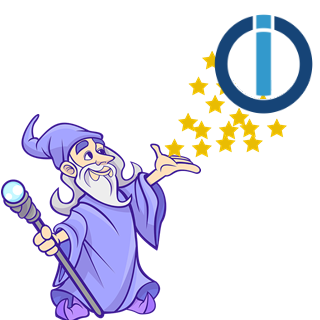

# ioBroker.unifi-access

**Tests:** 

## UniFi Access adapter for ioBroker

This adapter integrates Ubiquiti's UniFi Access platform with ioBroker. It uses the documented [UniFi Access Developer API](https://assets.identity.ui.com/unifi-access/api_reference.pdf) (also bundled in this repo at `.doc/api_reference.pdf`). Built around the **UA Ultra** standalone reader/hub/camera/doorbell, with basic integration for other UniFi Access devices (UA G2 Pro readers, UA G3 Pro doorbell, UA Hub). It can optionally pair with a UniFi Protect controller to enrich access events with camera snapshots and clip URLs, and ships a generic webhook receiver to bridge external alarm systems into ioBroker.

Capabilities exposed by the adapter:

- **Door unlock** — momentary pulse via `PUT /doors/:id/unlock`, or timed unlock for N minutes via `PUT /doors/:id/lock_rule`.
- **Emergency control** — `doors.emergency.lockdown` and `doors.emergency.evacuation` as read/write states (UniFi Access ≥ 1.24.6, written via `PUT /doors/settings/emergency`).
- **Live event stream** — UniFi Access WebSocket (`access.remote_view`, `access.remote_view.change`, `access.data.device.remote_unlock`) plus optional webhook receiver for the full event catalogue (`access.doorbell.incoming/.completed/.incoming.REN`, `access.door.unlock`, `access.device.dps_status`, `access.device.emergency_status`, `access.unlock_schedule.*`, `access.temporary_unlock.*`, `access.visitor.status.changed`).
- **Doorbell ringing notification** — passive: states show who is ringing and when. Accepting/rejecting calls is **not** part of this adapter — it requires WebRTC and is what the official UniFi Access mobile app is for.
- **Last-event thumbnail** — for UA Ultra, UA G3 Pro and UA G2 Pro, the adapter captures the `door_thumbnail` path from each event and exposes the latest image as a JPEG via a small built-in HTTP proxy (the controller serves it via `/system/static`, behind Bearer auth).
- **UniFi Protect integration (optional)** — links Protect cameras to access events, caching live snapshots and exposing them in the recent-events log alongside a clip URL.
- **Generic webhook receiver (optional)** — second HTTP endpoint with optional Basic/Bearer auth, lets external alarm systems push events into the adapter's `notifications.*` states.

Explicitly **not** provided in v1 (because the UniFi Access Developer API has no endpoint for it): on-demand camera snapshots, doorbell accept/reject, two-way audio, WebRTC live video.

---

## Credits

- **[UniFi Access Developer API reference](https://assets.identity.ui.com/unifi-access/api_reference.pdf)** — official endpoint documentation provided by Ubiquiti.
- **[hjdhjd/unifi-access](https://github.com/hjdhjd/unifi-access)** — community Node.js client that maps out many of the developer-API quirks and was used as a reference for the WebSocket event format.

A big thank you to all contributors of these projects!

## Disclaimer

This adapter is an independent, community-developed open-source project. It is **not affiliated with, endorsed by, or in any way officially connected to Ubiquiti Inc.**

*UniFi*, *UniFi Access*, *UA Ultra* and all other Ubiquiti trademarks are the property of Ubiquiti Inc. All product names, logos, and brands are property of their respective owners. The use of these names is for identification purposes only.

The adapter accesses the UniFi Access controller using the same APIs that are used by Ubiquiti's own clients. Use of those APIs is subject to Ubiquiti's Terms of Service. By using this adapter, you agree to comply with all applicable Ubiquiti terms and conditions. The author accepts no liability for any misuse of the adapter.

## Changelog
<!--
	Placeholder for the next version (at the beginning of the line):
	### **WORK IN PROGRESS**
-->
### **WORK IN PROGRESS**
- (ticaki) initial public skeleton — connection, bootstrap, door unlock, WebSocket event stream

## License
MIT License

Copyright (c) 2026 ticaki <github@renopoint.de>

Permission is hereby granted, free of charge, to any person obtaining a copy
of this software and associated documentation files (the "Software"), to deal
in the Software without restriction, including without limitation the rights
to use, copy, modify, merge, publish, distribute, sublicense, and/or sell
copies of the Software, and to permit persons to whom the Software is
furnished to do so, subject to the following conditions:

The above copyright notice and this permission notice shall be included in all
copies or substantial portions of the Software.

THE SOFTWARE IS PROVIDED "AS IS", WITHOUT WARRANTY OF ANY KIND, EXPRESS OR
IMPLIED, INCLUDING BUT NOT LIMITED TO THE WARRANTIES OF MERCHANTABILITY,
FITNESS FOR A PARTICULAR PURPOSE AND NONINFRINGEMENT. IN NO EVENT SHALL THE
AUTHORS OR COPYRIGHT HOLDERS BE LIABLE FOR ANY CLAIM, DAMAGES OR OTHER
LIABILITY, WHETHER IN AN ACTION OF CONTRACT, TORT OR OTHERWISE, ARISING FROM,
OUT OF OR IN CONNECTION WITH THE SOFTWARE OR THE USE OR OTHER DEALINGS IN THE
SOFTWARE.
